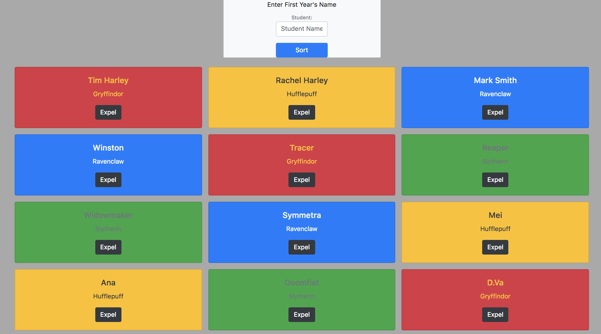

# sorting-hat
 

### About This App
The Sorting Hat uses a card building function and a random number generator to asign a Hogwarts house to the name of the student entered in a small form.  Before the app loads, instructions are presented on a Jumbotron.  All styling, including the cards, form, and jumbotron are provided by Bootstrap.  

 

### Provided Instructions
<a href="https://github.com/nss-nightclass-projects/exercise-vault/blob/master/EVENTS_sorting_hat.md">Sorting Hat</a>

 

### How to Use This App
1. Install `http-server` from `http://www.npmjs.com/package/htt-server`
2. In Terminal, navigate to the project folder and type: `http-server -p 8080`
3. In your browser, navigate to `http://localhost:8080`

Instructions will display when the page is initially loaded.  The app will not start until the 'Let's get started' button is clicked

 

### Screenshot 
